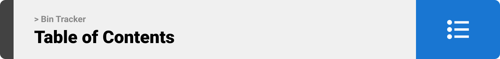

<br><br>



- [Project Philosophy](#project-philosophy)

- [Prototyping](#prototyping)

- [Teck Stack](#stacks)

- [Demo](#Demo)

- [How to Run](#run)
  
  - [Prerequisites](#prerequisites)
  
  - [Installation](#installation)


<!-- project philosophy -->

- <a name="project-philosophy"></a>
  
  

> A dashboard for the user to track custom data in a user-friendly experience.

<br>
<br>

<!-- Prototyping -->

<a name="prototyping"></a>


> I designed Dashboard.io using wireframes and mockups, iterating on the design until I reached the ideal layout for a seamless user experience.


<br><br>

<!-- Tech stack -->

<a name="stacks"></a>


> The Website utilizes React with Laravel Blade.

<br>

Dashboard.io is built using the following technologies:

- React: a robust JavaScript library for building reusable UI components.
- Laravel: a PHP framework for building web apps
- Axios: Enables network requests to the backend.
- Chart.js: Building interactive charts.
- tailwindcss: a css framework

<br>
<br>

<!-- Implementation -->

<a name="Demo" ></a>


> Using the mockups as a guide, I implemented Dashboard.io as follows: 


<br><br>

<!-- How to run -->

<a name="run" ></a>


> To set up Dashboard.io locally, follow these steps:

#### Prerequisites

- Node.js & npm
  1) Follow the instructions on this link to setup Node.js: https://www.geeksforgeeks.org/installation-of-node-js-on-windows/

#### Installation

1) Clone the repo
   
   ```sh
   git clone https://github.com/amr-hammoud/dashboard.git
   ```

2) Install NPM packages
   
   - navigate to the root directory and run this command
   
   ```sh
   npm install
   ```

3) Install Laravel dependencies
   
   - navigate to the root directory and run this command
   
   ```sh
   composer install
   ```

4) Launch the app
   
   - Run these 2 commands in 2 different terminals (both should be running at the same time)    
     
     ```sh
     npm run dev
     ```
     
     ```sh
     php artisan serve
     ```

5) Now the web app should be running
   Open a new tab in your web browser and access this url
   
   ```sh
   [http://127.0.0.1:8000/](http://127.0.0.1:8000/)
   ```